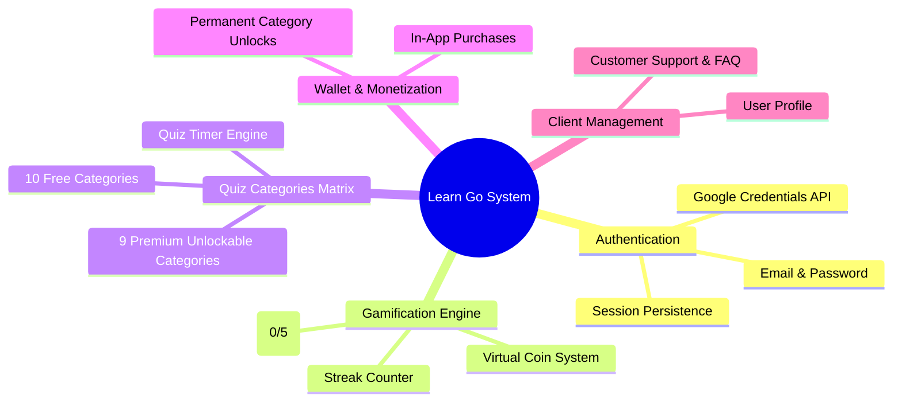
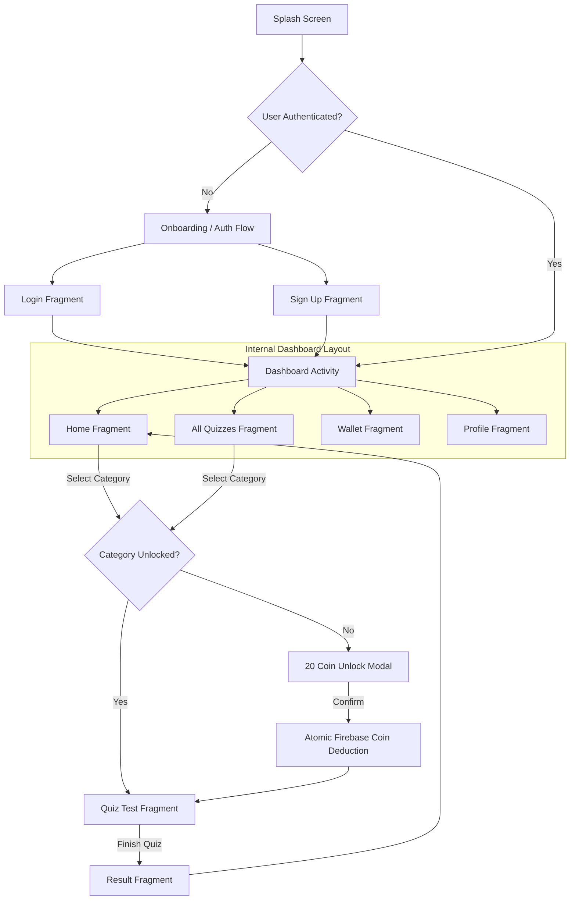
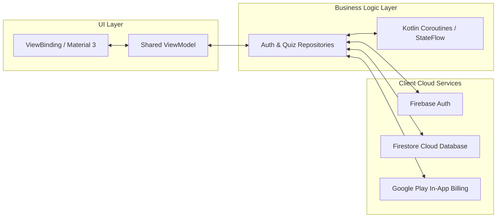

# 🎓 Learn Go - Client Application & Internal Technical Documentation

[](https://github.com/)
[](https://github.com/)
[](https://developer.android.com/about/versions/nougat)
[](https://kotlinlang.org)
[](https://developer.android.com/topic/architecture)

> [!CAUTION]
> **PROPRIETARY & STRICTLY CONFIDENTIAL CLIENT PROJECT**
> 
> This repository contains proprietary code, database schema, design assets, and intellectual property developed exclusively for the Client (**Nova Mind Labs**). 
> 
> - **UNAUTHORIZED ACCESS IS STRICTLY PROHIBITED.**
> - **NO PUBLIC PERMISSION**: No part of this repository may be cloned, reproduced, redistributed, mirrored, sublicensed, or reverse-engineered in any form or by any means.
> - **NON-DISCLOSURE AGREEMENT (NDA)**: Access to this code base is strictly restricted to authorized developers and project administrators under NDA.

---

## 🔒 Confidentiality & Intellectual Property Notice

| Property Attribute | Details |
|---|---|
| **Project Name** | Learn Go (LearnGo) |
| **Package Identifier** | `com.novamindlabs.learngo` |
| **Ownership** | **Nova Mind Labs** (All Rights Reserved) |
| **Project Status** | Private Client Production Project |
| **Licensing** | **Strictly Proprietary** (Not Open Source) |

---

## 🌟 Application System Architecture



---

## 🚀 Internal Application Flow



---

## 📚 Configured Category Matrix (19 Categories)

| # | Category Name (বাংলা) | Internal Category ID | Question Count | Access Tier | Coin Cost |
|---|---|---|---|---|---|
| 1 | **ইসলামিক কুইজ** | `Islamic` | 20 Questions | `Free` | 0 Coins |
| 2 | **হাদিসের গল্প** | `Hadis_Quiz` | 20 Questions | `Premium` | 20 Coins |
| 3 | **নবীদের জীবনী** | `Prophets_Quiz` | 20 Questions | `Free` | 0 Coins |
| 4 | **কুরআন কুইজ** | `Quran_Quiz` | 20 Questions | `Premium` | 20 Coins |
| 5 | **নামাজ শিক্ষা** | `Namaj_Quiz` | 20 Questions | `Free` | 0 Coins |
| 6 | **সাধারণ জ্ঞান** | `GK` | 20 Questions | `Premium` | 20 Coins |
| 7 | **বিজ্ঞান ও প্রযুক্তি** | `Science` | 20 Questions | `Premium` | 20 Coins |
| 8 | **ইতিহাসের পাতা** | `History` | 20 Questions | `Free` | 0 Coins |
| 9 | **খেলাধুলা** | `Sports` | 20 Questions | `Free` | 0 Coins |
| 10 | **ভূগোল কুইজ** | `Geography` | 20 Questions | `Premium` | 20 Coins |
| 11 | **বাংলাদেশের ইতিহাস** | `BD_History` | 20 Questions | `Free` | 0 Coins |
| 12 | **বিশ্ব ও দেশ** | `World_Country` | 20 Questions | `Premium` | 20 Coins |
| 13 | **সাহাবীদের জীবন** | `Sahaba_Life` | 20 Questions | `Free` | 0 Coins |
| 14 | **ইসলামের ইতিহাস** | `Islamic_History` | 20 Questions | `Premium` | 20 Coins |
| 15 | **ধাঁধা ও বুদ্ধির খেলা** | `Riddles` | 20 Questions | `Free` | 0 Coins |
| 16 | **ইংরেজি ভাষা** | `English_Lang` | 20 Questions | `Premium` | 20 Coins |
| 17 | **কম্পিউটার ও আইটি** | `Computer_IT` | 20 Questions | `Free` | 0 Coins |
| 18 | **প্রাণীজগৎ** | `Animal_World` | 20 Questions | `Free` | 0 Coins |
| 19 | **আবিষ্কার ও আবিষ্কারক** | `Inventions` | 20 Questions | `Premium` | 20 Coins |

---

## 🛠️ Internal Tech Stack Specifications



### Core Architecture Specifications
- **Architecture Pattern**: MVVM (Model-View-ViewModel) + Repository Pattern
- **Language**: Kotlin 100% (Coroutines, Flow, StateFlow, KTX)
- **Dependency Injection**: Hilt / Dagger
- **UI Framework**: ViewBinding, Material Components 3, Custom Glassmorphism Vectors, Intuit SDP/SSP Responsive Layouts
- **Cloud Backend**: Firebase Auth, Firebase Firestore, Firebase Storage
- **Monetization**: Google Play Billing Library v8.0.0
- **Optimization**: R8 Code Shrinking & Resource Shrinking Enabled

---

## 📁 Internal Source Code Organization

```
com.novamindlabs.learngo
├── core/
│   ├── Nodes.kt               # Protected Cloud Firestore Schema Nodes
│   └── Resource.kt            # Internal UI State Wrapper
├── data/
│   ├── model/
│   │   ├── QuizQuestion.kt    # Question & Option Schema
│   │   └── UserRegister.kt    # User Account Schema
│   └── repository/
│       └── AuthRepository.kt  # Cloud Auth & Database Transactions
├── di/
│   ├── AppModule.kt           # Hilt Dependency Modules
│   └── MyApp.kt               # Application Context
└── ui/
    ├── adapter/
    │   └── QuizAdapter.kt     # Custom Category Adapter
    ├── viewModel/
    │   └── AuthViewModel.kt   # Core State ViewModel
    └── views/
        ├── auth/              # Client Login & Registration Views
        ├── dashboard/         # Dashboard Screens
        ├── intro/             # Onboarding & Splash Screens
        └── support/           # Help & Customer Support
```

---

## ⚙️ R8 & ProGuard Production Security

> [!IMPORTANT]
> ProGuard code obfuscation and resource stripping are configured in `app/proguard-rules.pro` to protect client intellectual property and prevent reverse-engineering.

- **R8 Minification**: Active (`isMinifyEnabled = true`)
- **Resource Stripping**: Active (`isShrinkResources = true`)
- **Obfuscation**: Class & method name obfuscation enabled

---

## 🔐 Authorized Environment Setup (Authorized Maintainers Only)

> [!WARNING]
> Only personnel with authorized credentials and private client Firebase configuration files may build or deploy this application.

### Internal Build Instructions

1. **Verify Official Client Credentials**:
   - Ensure the private `google-services.json` provided by the client is placed in the `app/` root directory.

2. **Compile Release Production Bundle**:
   ```bash
   ./gradlew assembleRelease
   ```

---

## 📜 Copyright & Non-Disclosure Notice

```
CONFIDENTIAL AND PROPRIETARY PROPERTY OF NOVA MIND LABS.
ALL RIGHTS RESERVED.

UNAUTHORIZED COPYING, CLONING, DISTRIBUTION, OR USE OF THIS CODEBASE 
IS STRICTLY PROHIBITED AND SUBJECT TO LEGAL ACTION.
```
